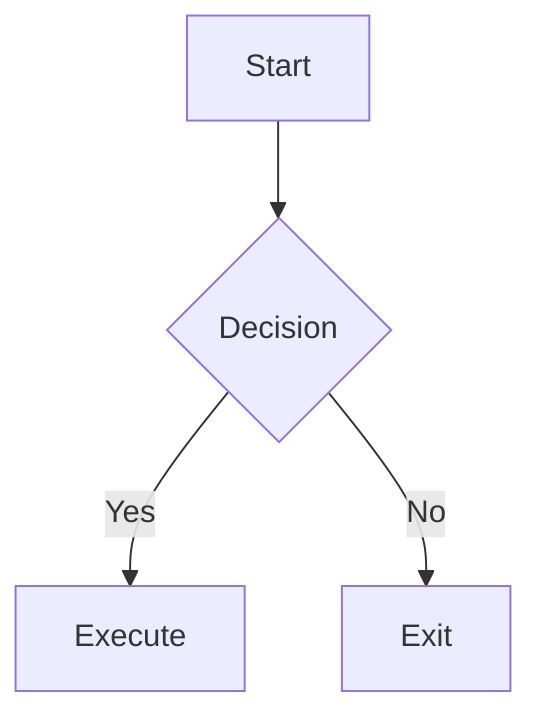

---
title: Markdown Syntax Support
tags: [Editor]
---

# Markdown Syntax Support

Built on the TipTap 3.x + CodeMirror 6 engine, QuillNote supports full CommonMark and GitHub Flavored Markdown (GFM) syntax, and extends capabilities with WikiLinks, Callouts, math formulas, Mermaid, footnotes, and more. This page summarizes the most commonly used syntax for writing.

> [!NOTE]
> The following examples can be typed directly in **Instant Rendering** mode (where they will auto-render) or written as plain text in **Source View** mode. See [[02-Editor/01-Editing-Modes]] for switching instructions.

## Basic Syntax

### Headings

```markdown
# Heading 1
## Heading 2
### Heading 3
#### Heading 4
##### Heading 5
###### Heading 6
```

> Quick heading level setting: `Ctrl+Alt+1` ~ `Ctrl+Alt+6`, `Ctrl+Alt+0` to revert to a normal paragraph. See [[07-Settings/04-Keyboard-Shortcuts]] for details.

### Text Formatting

```markdown
**Bold**
*Italic*
~~Strikethrough~~
`Inline Code`
==Highlighted Text==
```

### Lists

```markdown
- Unordered list item
- Another item

1. Ordered list item
2. Another item

- [ ] Incomplete task
- [x] Completed task
```

### Links and Images

```markdown
[Link Text](https://example.com)

```

### Blockquotes

```markdown
> This is a blockquote
> Supports multiple lines
```

### Code Blocks

Use three backticks to wrap code, and specify the language for highlighting:

````markdown
```javascript
function hello() {
  console.log("Hello, QuillNote!");
}
```
````

> See [[02-Editor/03-Code-Blocks]] for details.

## GFM Extensions

### Tables

```markdown
| Col1 | Col2 | Col3 |
|------|------|------|
| Content | Content | Content |
```

> Tables can also be created and edited using the floating toolbar in Instant Rendering mode. See [[02-Editor/08-Table-Operations]].

### Auto Links

URLs written directly are automatically recognized as links:

```
https://example.com
```

### Task Lists

See the `- [ ]` / `- [x]` syntax in "Lists" above. `Ctrl+Shift+J` toggles task completion status.

## Extended Syntax

### Callout Blocks

GitHub-style callout blocks with 15 types, declared using blockquotes with `[!TYPE]`:

```markdown
> [!NOTE]
> This is a regular note

> [!TIP]
> This is a tip

> [!WARNING]
> This is a warning
```

Supported types: `NOTE`, `TIP`, `IMPORTANT`, `WARNING`, `CAUTION`, `ABSTRACT`, `INFO`, `SUCCESS`, `QUESTION`, `FAILURE`, `DANGER`, `BUG`, `EXAMPLE`, `QUOTE`, `FAQ`.

> See [[02-Editor/06-Callout-Blocks]] for complete types and collapse controls.

### Footnotes

```markdown
Body text that needs additional explanation[^1]

[^1]: This is the specific content of the footnote.
```

### Table of Contents

Insert `[toc]` in the document to generate a table of contents (depends on the "Table of Contents" toggle in settings).

```markdown
[toc]
```

### Superscript and Subscript

```markdown
Superscript: X^2^
Subscript: H~2~O
```

### YAML Frontmatter

The `---` block at the beginning of a file is used to define metadata:

```yaml
---
title: Document Title
tags: [tag1, tag2]
date: 2024-01-01
---
```

> See [[02-Editor/07-Frontmatter]] for details.

## Knowledge Management Syntax

### Wiki Links

```markdown
[[Note Name]]
[[Note Name|Display Alias]]
[[Note Name#Heading]]
```

> See [[03-Knowledge-Management/01-Wiki-Links]] for details.

### Embedded Content

```markdown
![[Note Name]]
![[Note Name#Heading]]
![[Image.png]]
```

> See [[03-Knowledge-Management/02-Embedded-Content]] for details.

## Math Formulas

Supports both KaTeX and MathJax engines:

```markdown
Inline formula: $E=mc^2$

Block formula:
$$
\sum_{i=1}^{n} i = \frac{n(n+1)}{2}
$$
```

> See [[02-Editor/04-Math-Formulas]] for details.

## Mermaid Diagrams

```markdown

```

> See [[02-Editor/05-Mermaid-Diagrams]] for details.

## Related Documents

- [[02-Editor/04-Math-Formulas]] — Formula details
- [[02-Editor/03-Code-Blocks]] — Code highlighting
- [[02-Editor/08-Table-Operations]] — Table editing
- [[02-Editor/06-Callout-Blocks]] — Callout types
- [[02-Editor/07-Frontmatter]] — Metadata
- [[03-Knowledge-Management/01-Wiki-Links]] — Bidirectional link syntax
- [[02-Editor/01-Editing-Modes]] — Editing mode introduction
