---
title: Mermaid Diagrams
tags: [Editor]
---

# Mermaid Diagrams

QuillNote integrates the Mermaid diagram engine, allowing you to draw flowcharts, sequence diagrams, Gantt charts, class diagrams, state diagrams, and more directly in Markdown using text, with real-time rendered previews.

> [!NOTE]
> Write using mermaid code blocks. Diagram rendering is enabled by default and can be disabled in settings.

## Basic Syntax

Use `mermaid` as the code block language:

````markdown
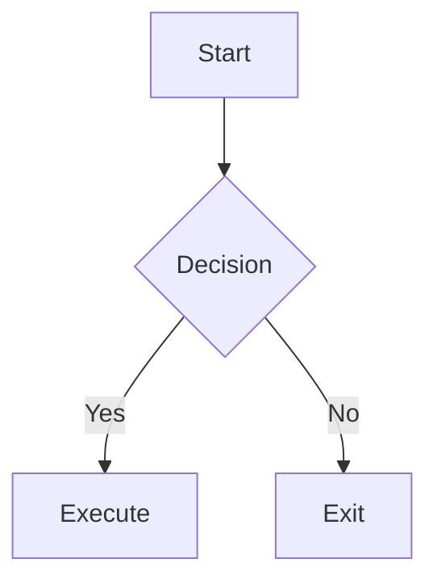
````

## Mermaid Examples

Flowchart

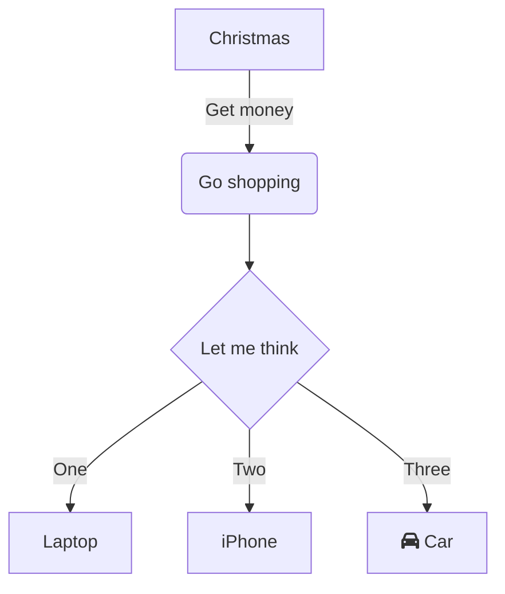

Class Diagram

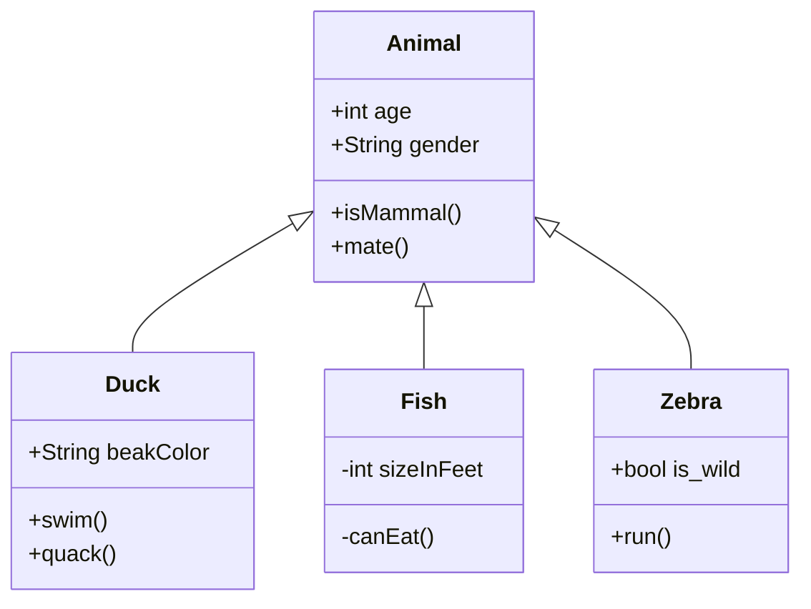

State Diagram

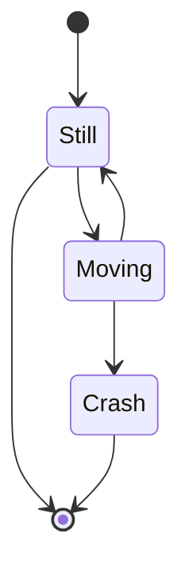

ER Diagram

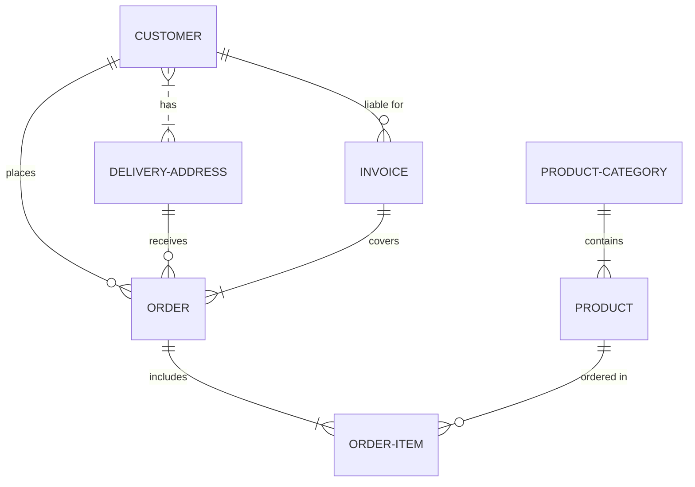

XY Chart

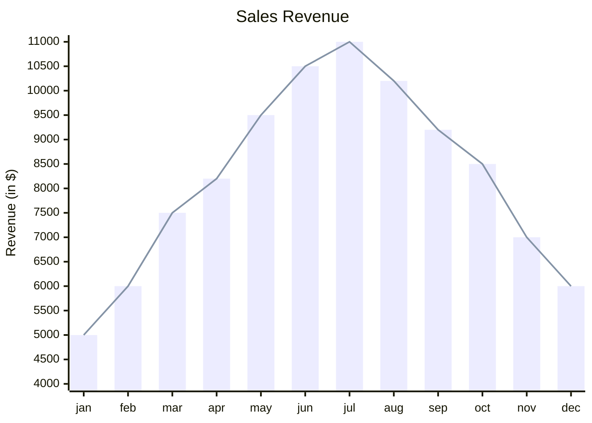

Journey Diagram

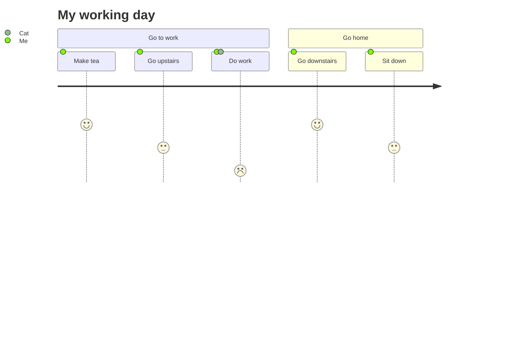

Gantt Chart

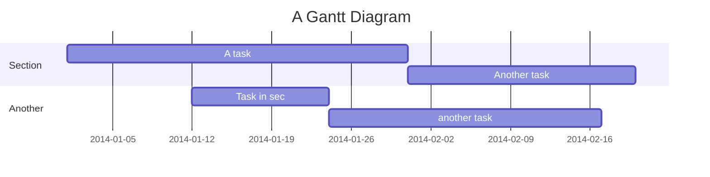

Pie Chart

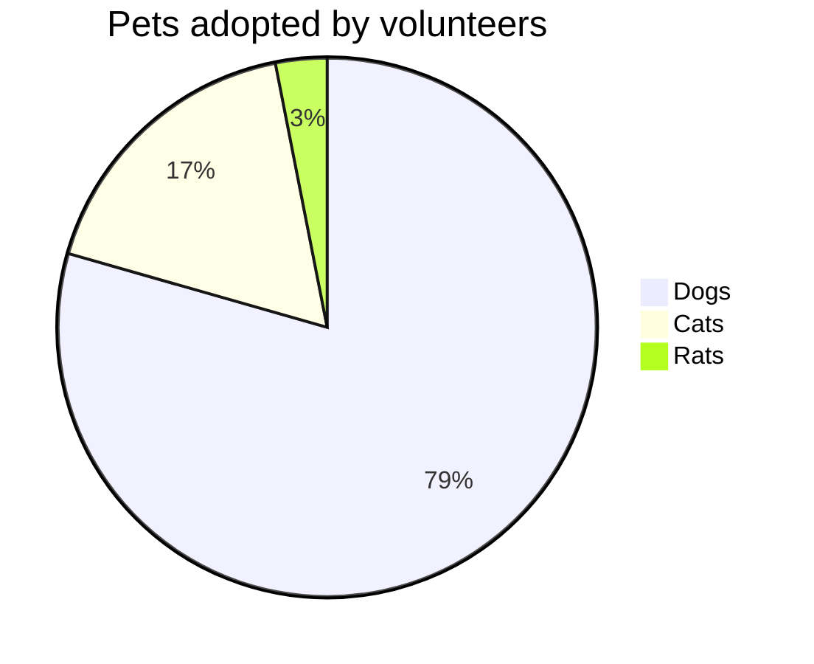

Quadrant Chart

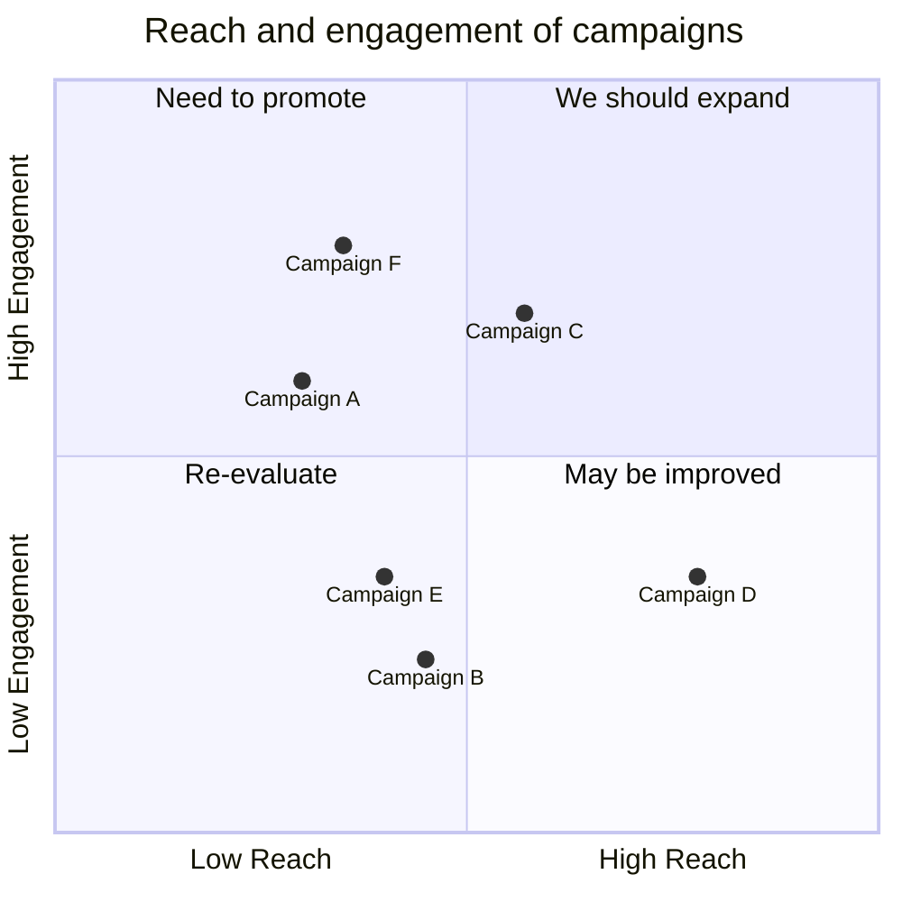

Mind Map

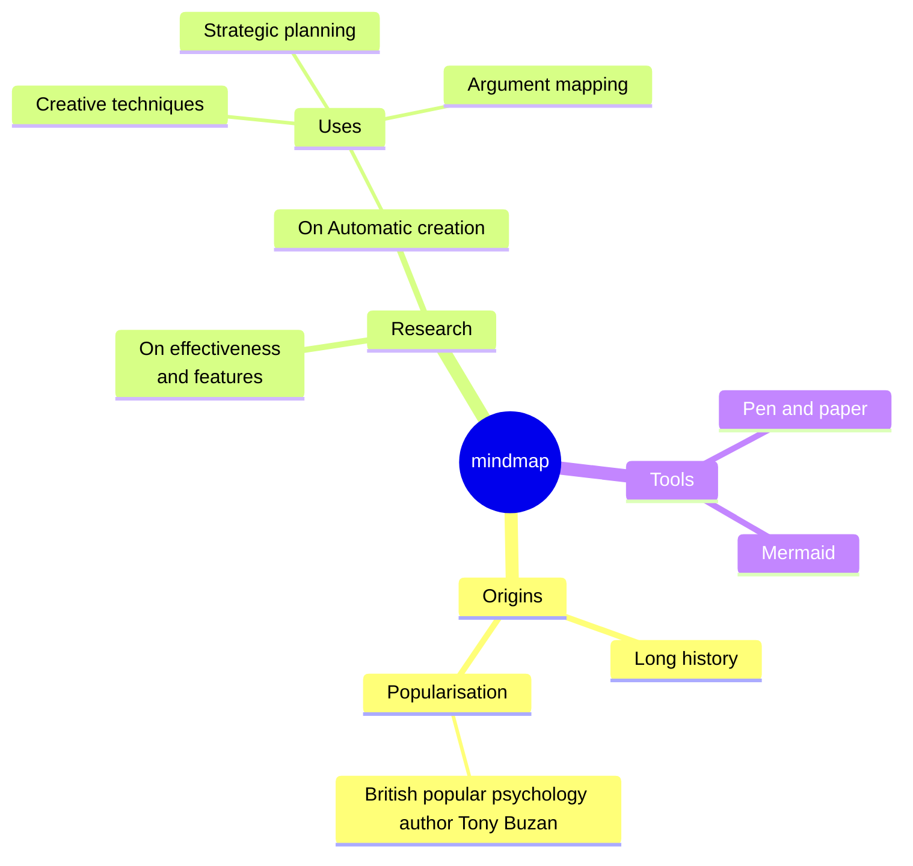

Git Graph

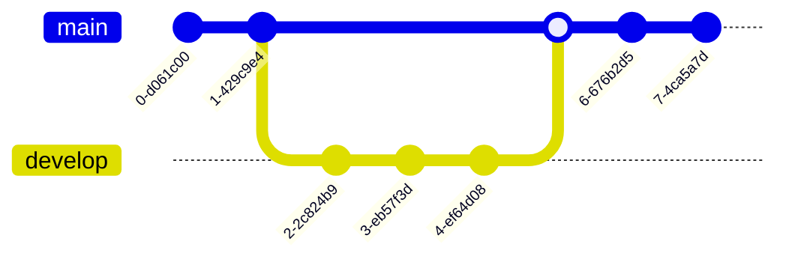

Kanban

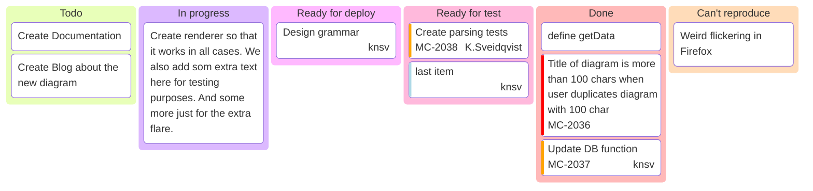

Architecture Diagram

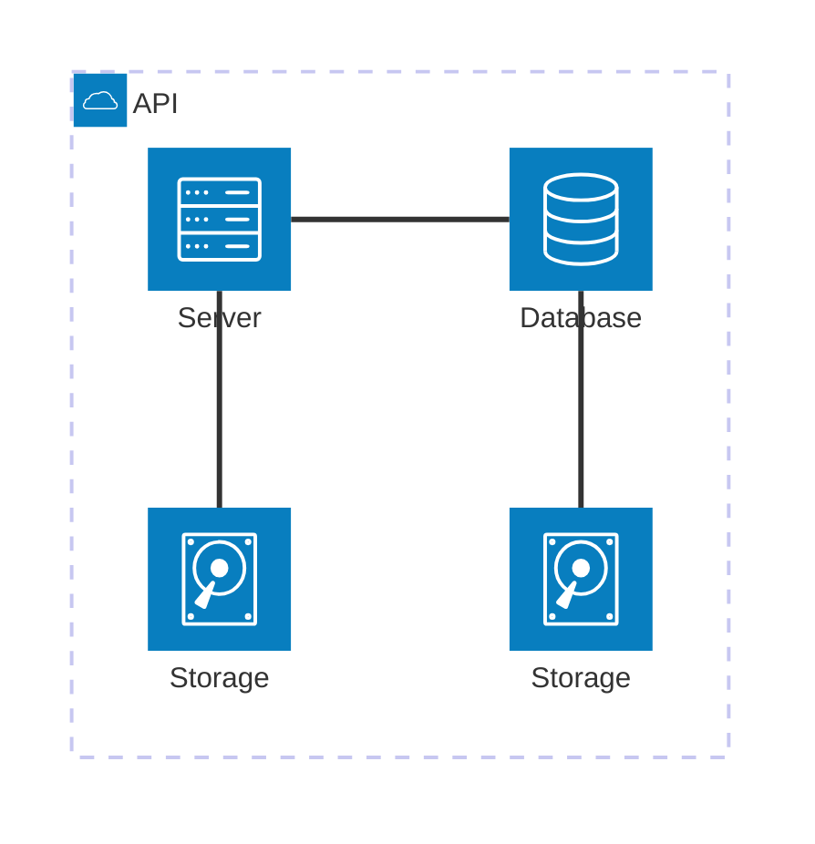

Packet Diagram

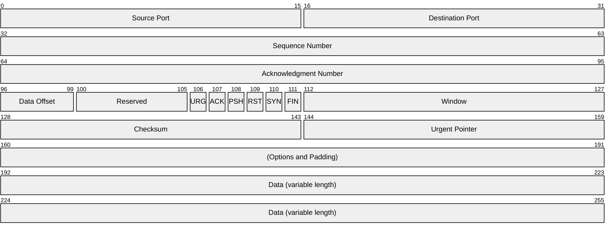
